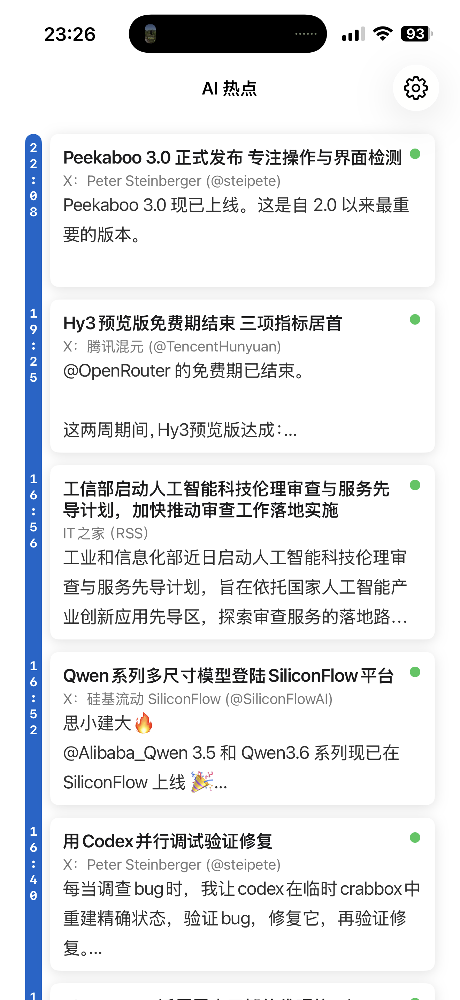
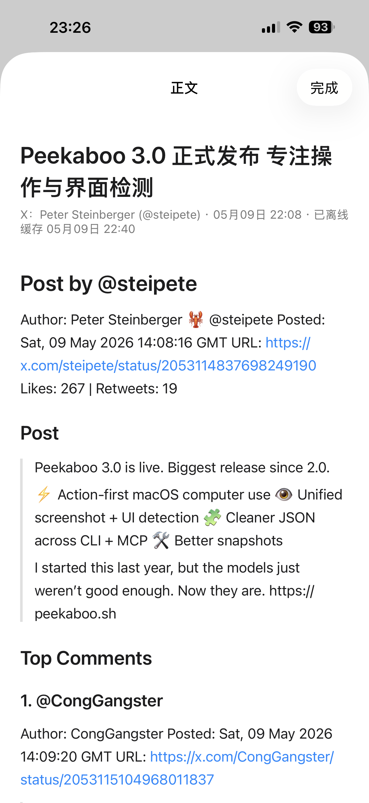

# AI HOT iOS

`AI HOT iOS` 是一个面向 iPhone 的 AI 资讯阅读客户端，内容来自 **数字生命卡兹克** 的精选 feed。

项目对应站点：<https://aihot.virxact.com>

## 项目简介

这个项目聚焦“少而精”的 AI 信息流：抓取 AI 圈动态后筛掉噪声，只保留更值得看的内容，并提供移动端阅读体验。

更多背景可见：<https://aihot.virxact.com/about>

## 应用截图

<p>
  
  
</p>

## 主要功能

- 精选 feed 时间线浏览
- 下拉刷新与分页加载
- 离线正文缓存（Markdown）
  - 刷新后处理最近 20 条 feed
  - 调用 Firecrawl 将网页转换为 Markdown
  - 使用 SwiftData 落盘本地缓存
- 缓存状态可视化
  - 黄色：未开始
  - loading：缓存中
  - 绿色：缓存成功
  - 红色：缓存失败
- 卡片点击阅读策略
  - 已缓存：打开 Markdown 阅读页
  - 未缓存或失败：回退到 WebView（SafariView）在线加载
- 设置页支持自定义 `Firecrawl API Key`（Keychain 存储）
  - 未配置 Key 时，不启用离线缓存服务

## 技术栈

- SwiftUI
- SwiftData
- URLSession
- [swift-markdown](https://github.com/swiftlang/swift-markdown)
- SFSafariViewController

## 本地运行

1. 使用 Xcode 打开 `hhai.xcodeproj`
2. 选择 `hhai` Scheme
3. 运行到模拟器或真机
4. 首次建议在右上角设置页填入 `Firecrawl API Key` 以启用离线缓存

命令行构建：

```bash
xcodebuild -project hhai.xcodeproj -scheme hhai -destination 'generic/platform=iOS' CODE_SIGNING_ALLOWED=NO build
```

## 开源协议

本项目使用 [MIT License](./LICENSE) 开源。
